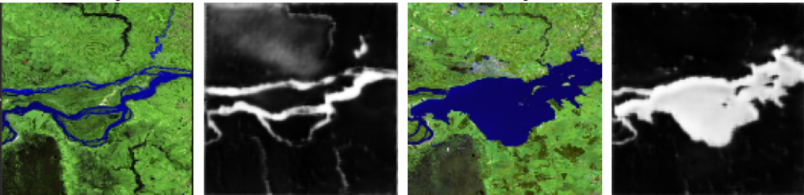

# Google Girl Hackathon Project--Semantic Segmentation of Flood Events using U-Net for Real-Time Flood Hazard Assessment.
## Data Source

Public images: 
- The dataset, sourced from the Kaggle open-source community, encompasses 3000 high-resolution images depicting various water bodies, complemented by their respective masks for precise delineation.

https://www.kaggle.com/datasets/franciscoescobar/satellite-images-of-water-bodies/data

## Proposed Methodology

### Model: UNET 
The <b> U-Net </b> is convolutional network architecture for fast and precise segmentation of images. It is an encoder-decoder style structure allows the network to capture context and localize the precise areas of interest in an image. 

- The encoder gradually reduces the spatial dimension with pooling layers, which helps the network to understand the context in the image.

- The decoder, on the other hand, gradually recovers the object details and spatial dimensions.

##  Running the app
> conda create -n ggh python=3.9  
> conda activate ggh  
> pip install -r requirements.txt  
> streamlit run app.py --server.enableXsrfProtection false

## Predictions

          
## Conclusion
The solution provided utilizes Convolutional neural networks trained on pairs of water-bodies and their masks that leverages remote sensing data for robust water segmentation, ultimately aiding flood response teams with precise location for targeted rescue efforts.It uses the <b>U-Net Architecture</b> into the model pipeline, ensuring efficient training and evaluation process.

## Latest Feature
Visualization of affected area on Google Maps